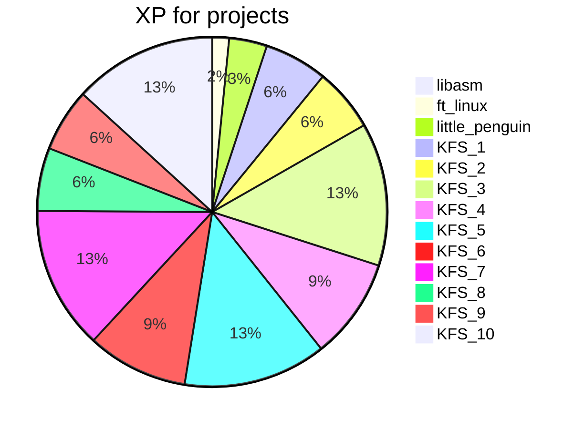
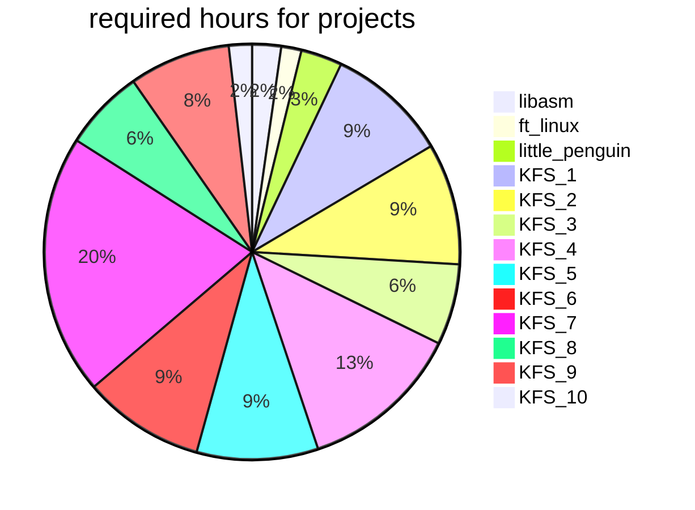

## System, Kernel branch

<table>
<tr><th>Project</th><th>Team</th><th>Time</th><th>XP</th><th>Description</th></tr>
<tr><td>libasm <td>Solo<td>70h<td>966<td>The aim of this project is to get familiar with assembly language.</tr>
<tr><td>ft_linux <td>Solo<td>49h<td>4200<td>Make your own linux distribution.</tr>
<tr><td>little_penguin <td>Solo<td>100h<td>9450<td>This all subject has been made from the eudyptula challenge.</tr>
<tr><td>KFS_1 <td>Group 2<td>294h<td>15750<td>Grub, boot and screen</tr>
<tr><td>KFS_2 <td>Group 2<td>294h<td>15750<td>GDT & Stack</tr>
<tr><td>KFS_3 <td>Group 2<td>196h<td>35700<td>Memory</tr>
<tr><td>KFS_4 <td>Group 2<td>392h<td>25200<td>Interrupts</tr>
<tr><td>KFS_5 <td>Group 2<td>294h<td>35700<td>Processes</tr>
<tr><td>KFS_6 <td>Group 2<td>294h<td>25200<td>Filesystem</tr>
<tr><td>KFS_7 <td>Group 2<td>630h<td>35700<td>Syscalls, Sockets and env</tr>
<tr><td>KFS_8 <td>Group 2<td>196h<td>15750<td>Modules</tr>
<tr><td>KFS_9 <td>Group 2<td>245h<td>15750<td>ELF</tr>
<tr><td>KFS_10 <td>Group 2<td>56h<td>35700<td>The END</tr>
</table>

